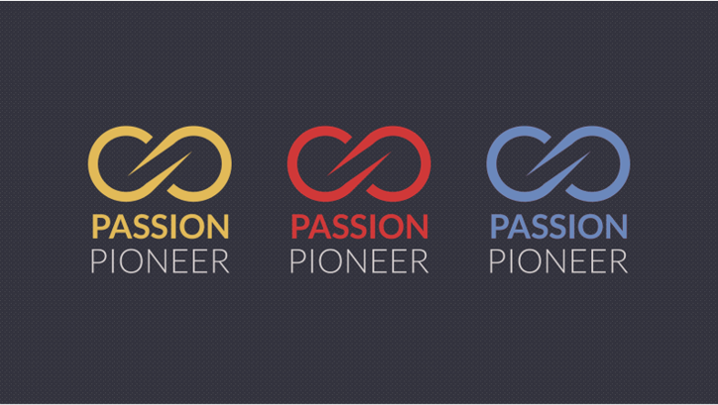

<!-- 

 -->
<h1 align='center'> Passion & Pionner</h1>
한국외국어대학교 컴퓨터공학부 소속 학술학회 입니다. 
App, Web, AI, Data, 보안, 게임 등 여러 팀으로 활동하고 있습니다. 
1999년에 시작되어 현재 재학생 40명이 활동하고 있습니다. 

# 이번 주 공지사항
1. 현업 개발자의 실무 멘토링
2. 재학생 멘토 멘티
3. 화상 스터디
4. 주간 알고리즘
## 팀
- App
- Web
- ...
* 안녕
* 하세요 
+ ㅎㅎㅎ
 
### Contact

### Skills
##### Language

  

##### Platform

    

<!-- 

    

 -->

<!-- 
 -->
<!--  -->
<!--
**SeongilHeo/SeongilHeo** is a ✨ _special_ ✨ repository because its `README.md` (this file) appears on your GitHub profile.

Here are some ideas to get you started:

- 🔭 I’m currently working on ...
- 🌱 I’m currently learning ...
- 👯 I’m looking to collaborate on ...
- 🤔 I’m looking for help with ...
- 💬 Ask me about ...
- 📫 How to reach me: ...
- 😄 Pronouns: ...
- ⚡ Fun fact: ...
-->
